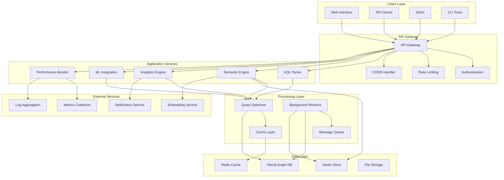
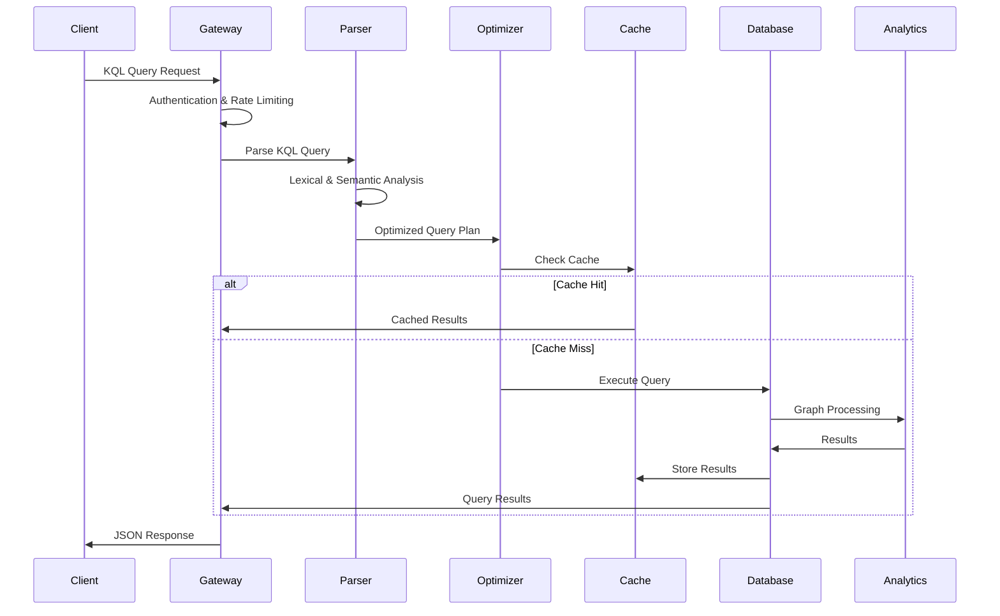
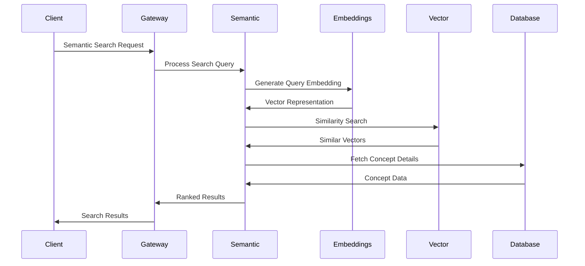
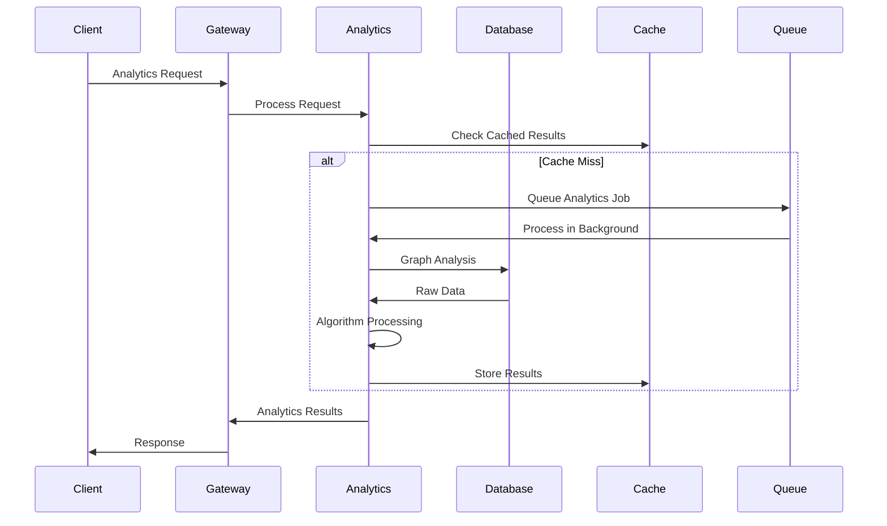
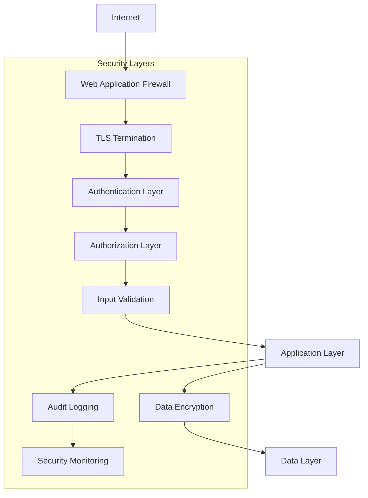

# KIP System Architecture

## Overview

The Knowledge Integration Platform (KIP) is built on a modern, scalable architecture designed to handle complex knowledge graphs, semantic search, and real-time analytics. This document provides a comprehensive overview of the system architecture, components, and design decisions.

## Architecture Principles

### Core Principles

1. **Modularity**: Each component has a single responsibility and clear interfaces
2. **Scalability**: Horizontal scaling capabilities for high-volume workloads
3. **Performance**: Sub-second response times for most operations
4. **Reliability**: 99.9% uptime with graceful degradation
5. **Security**: Defense in depth with multiple security layers
6. **Extensibility**: Plugin architecture for custom functionality

### Design Patterns

- **Microservices Architecture**: Loosely coupled services with well-defined APIs
- **Event-Driven Architecture**: Asynchronous processing and real-time updates
- **CQRS (Command Query Responsibility Segregation)**: Separate read and write operations
- **Repository Pattern**: Abstracted data access layer
- **Observer Pattern**: Event notifications and monitoring
- **Strategy Pattern**: Pluggable algorithms and components

## System Overview



## Component Architecture

### 1. API Gateway Layer

#### API Gateway
- **Purpose**: Single entry point for all client requests
- **Technology**: Express.js with custom middleware
- **Features**:
  - Request routing and load balancing
  - Protocol translation (HTTP/WebSocket/GraphQL)
  - Request/response transformation
  - API versioning support

#### Authentication Service
- **Purpose**: Identity verification and authorization
- **Technology**: JWT with Bearer tokens
- **Features**:
  - Token validation and refresh
  - Role-based access control (RBAC)
  - Session management
  - Audit logging

#### Rate Limiting
- **Purpose**: Protect against abuse and ensure fair usage
- **Technology**: Redis-based sliding window
- **Features**:
  - Per-user rate limiting
  - Burst protection
  - Adaptive thresholds
  - Priority queuing

### 2. Application Services Layer

#### KQL Parser
- **Purpose**: Parse and validate Knowledge Query Language
- **Technology**: Custom parser with AST generation
- **Components**:
  - Lexical analyzer
  - Syntax parser
  - Semantic analyzer
  - Query optimizer integration

```javascript
// KQL Parser Architecture
class KQLParser {
  lexer: KQLLexer;
  parser: SyntaxParser;
  validator: SemanticValidator;
  optimizer: QueryOptimizer;

  parse(query: string): ParsedQuery {
    const tokens = this.lexer.tokenize(query);
    const ast = this.parser.parse(tokens);
    const validated = this.validator.validate(ast);
    return this.optimizer.optimize(validated);
  }
}
```

#### Semantic Engine
- **Purpose**: Vector embeddings and semantic similarity
- **Technology**: TensorFlow.js with pre-trained models
- **Components**:
  - Embedding generator
  - Vector index manager
  - Similarity calculator
  - Clustering algorithms

#### Analytics Engine
- **Purpose**: Graph analytics and insights
- **Technology**: Neo4j with custom algorithms
- **Components**:
  - Centrality calculators
  - Community detection
  - Pattern mining
  - Temporal analysis

#### ML Integration
- **Purpose**: Machine learning model integration
- **Technology**: TensorFlow.js and scikit-learn
- **Components**:
  - Model manager
  - Feature extractors
  - Prediction engine
  - Online learning

#### Performance Monitor
- **Purpose**: Real-time system monitoring
- **Technology**: Prometheus with custom metrics
- **Components**:
  - Metrics collector
  - Alert manager
  - Health checker
  - Performance profiler

### 3. Processing Layer

#### Query Optimizer
- **Purpose**: Optimize query execution plans
- **Technology**: Cost-based optimization
- **Features**:
  - Query plan generation
  - Index selection
  - Join reordering
  - Caching strategies

#### Cache Layer
- **Purpose**: High-performance data caching
- **Technology**: Redis with intelligent eviction
- **Features**:
  - Multi-level caching
  - Cache warming
  - Intelligent invalidation
  - Distributed caching

#### Message Queue
- **Purpose**: Asynchronous task processing
- **Technology**: Redis Pub/Sub with Bull
- **Features**:
  - Priority queues
  - Retry logic
  - Dead letter queues
  - Monitoring

### 4. Data Layer

#### Neo4j Graph Database
- **Purpose**: Primary graph data storage
- **Technology**: Neo4j 5.x with APOC
- **Configuration**:
  - Clustered deployment
  - Read replicas
  - Backup automation
  - Performance tuning

#### Vector Store
- **Purpose**: Vector embeddings storage
- **Technology**: Specialized vector database
- **Features**:
  - High-dimensional vectors
  - Similarity search
  - Index optimization
  - Compression

#### Redis Cache
- **Purpose**: High-speed data caching
- **Technology**: Redis Cluster
- **Configuration**:
  - Memory optimization
  - Persistence configuration
  - Clustering setup
  - Monitoring

## Data Flow Architecture

### Query Processing Flow



### Semantic Search Flow



### Analytics Processing Flow



## Scalability Architecture

### Horizontal Scaling

#### Database Scaling
```yaml
neo4j_cluster:
  core_servers: 3
  read_replicas: 6
  load_balancer: "haproxy"
  sharding_strategy: "none"  # Graph databases don't shard well
  backup_strategy: "continuous"

redis_cluster:
  nodes: 6
  shards: 3
  replicas: 1
  consistency: "eventual"
```

#### Application Scaling
```yaml
application_scaling:
  api_gateway:
    instances: 3
    load_balancer: "nginx"
    health_checks: true

  services:
    semantic_engine:
      instances: 4
      cpu_intensive: true
    analytics_engine:
      instances: 2
      memory_intensive: true
    ml_integration:
      instances: 3
      gpu_enabled: true
```

### Performance Optimization

#### Caching Strategy
```javascript
// Multi-level Caching Architecture
class CacheManager {
  constructor() {
    this.l1Cache = new Map(); // In-memory
    this.l2Cache = new RedisCache(); // Distributed
    this.l3Cache = new DatabaseCache(); // Persistent
  }

  async get(key) {
    // L1: In-memory cache (fastest)
    let value = this.l1Cache.get(key);
    if (value) return value;

    // L2: Redis cache (fast)
    value = await this.l2Cache.get(key);
    if (value) {
      this.l1Cache.set(key, value);
      return value;
    }

    // L3: Database cache (fallback)
    value = await this.l3Cache.get(key);
    if (value) {
      this.l1Cache.set(key, value);
      this.l2Cache.set(key, value);
      return value;
    }

    return null;
  }
}
```

#### Query Optimization
```javascript
// Query Optimization Pipeline
class QueryOptimizer {
  optimize(query) {
    return this.pipeline([
      this.parseQuery,
      this.analyzeComplexity,
      this.selectIndexes,
      this.reorderJoins,
      this.addCaching,
      this.generatePlan
    ])(query);
  }

  analyzeComplexity(query) {
    const complexity = this.calculateComplexity(query);
    if (complexity > THRESHOLD) {
      query.enableParallelization = true;
      query.useIndexHints = true;
    }
    return query;
  }
}
```

## Security Architecture

### Defense in Depth



### Security Components

#### Authentication & Authorization
```javascript
class SecurityManager {
  constructor() {
    this.auth = new JWTAuthentication();
    this.rbac = new RoleBasedAccessControl();
    this.audit = new AuditLogger();
  }

  async authorize(request) {
    // Verify JWT token
    const user = await this.auth.verify(request.token);

    // Check permissions
    const hasPermission = await this.rbac.checkPermission(
      user.id,
      request.resource,
      request.action
    );

    // Log access attempt
    await this.audit.log({
      user: user.id,
      resource: request.resource,
      action: request.action,
      granted: hasPermission,
      timestamp: new Date()
    });

    return hasPermission;
  }
}
```

#### Input Validation
```javascript
class InputValidator {
  validateKQLQuery(query) {
    // Length validation
    if (query.length > MAX_QUERY_LENGTH) {
      throw new ValidationError('Query too long');
    }

    // Character whitelist
    if (!ALLOWED_CHARACTERS.test(query)) {
      throw new ValidationError('Invalid characters');
    }

    // SQL injection patterns
    for (const pattern of SQL_INJECTION_PATTERNS) {
      if (pattern.test(query)) {
        throw new SecurityError('Potential SQL injection');
      }
    }

    // XSS patterns
    for (const pattern of XSS_PATTERNS) {
      if (pattern.test(query)) {
        throw new SecurityError('Potential XSS attack');
      }
    }

    return query;
  }
}
```

## Monitoring Architecture

### Observability Stack

```yaml
monitoring_stack:
  metrics:
    prometheus:
      scrape_interval: "15s"
      retention: "30d"
    grafana:
      dashboards: "kip-system-dashboard"

  logging:
    elasticsearch:
      cluster_size: 3
      retention: "90d"
    logstash:
      pipelines: "application,security,performance"
    kibana:
      dashboards: "kip-logs-dashboard"

  tracing:
    jaeger:
      sampling_rate: 0.1
      storage: "elasticsearch"

  alerting:
    alertmanager:
      notification_channels: ["slack", "email", "pagerduty"]
```

### Health Monitoring

```javascript
class HealthMonitor {
  constructor() {
    this.checks = [
      new DatabaseHealthCheck(),
      new CacheHealthCheck(),
      new APIHealthCheck(),
      new MemoryHealthCheck(),
      new DiskHealthCheck()
    ];
  }

  async getSystemHealth() {
    const results = await Promise.all(
      this.checks.map(check => check.execute())
    );

    const overallHealth = this.calculateOverallHealth(results);

    return {
      status: overallHealth.status,
      score: overallHealth.score,
      components: results,
      timestamp: new Date()
    };
  }

  calculateOverallHealth(results) {
    const weights = {
      database: 0.4,
      cache: 0.2,
      api: 0.2,
      memory: 0.1,
      disk: 0.1
    };

    let score = 0;
    for (const result of results) {
      score += result.score * weights[result.component];
    }

    return {
      score: Math.round(score),
      status: score >= 90 ? 'healthy' : score >= 70 ? 'degraded' : 'unhealthy'
    };
  }
}
```

## Deployment Architecture

### Container Architecture

```dockerfile
# Multi-stage Docker build
FROM node:18-alpine AS builder
WORKDIR /app
COPY package*.json ./
RUN npm ci --only=production

FROM node:18-alpine AS runtime
WORKDIR /app
COPY --from=builder /app/node_modules ./node_modules
COPY . .
EXPOSE 8081
CMD ["node", "nexus/server-phase7.js"]
```

### Kubernetes Deployment

```yaml
apiVersion: apps/v1
kind: Deployment
metadata:
  name: kip-nexus
spec:
  replicas: 3
  selector:
    matchLabels:
      app: kip-nexus
  template:
    metadata:
      labels:
        app: kip-nexus
    spec:
      containers:
      - name: kip-nexus
        image: kip/nexus:latest
        ports:
        - containerPort: 8081
        env:
        - name: NEO4J_URI
          value: "bolt://neo4j:7687"
        - name: REDIS_URL
          value: "redis://redis:6379"
        resources:
          requests:
            memory: "512Mi"
            cpu: "250m"
          limits:
            memory: "1Gi"
            cpu: "500m"
        livenessProbe:
          httpGet:
            path: /health
            port: 8081
          initialDelaySeconds: 30
          periodSeconds: 10
        readinessProbe:
          httpGet:
            path: /ready
            port: 8081
          initialDelaySeconds: 5
          periodSeconds: 5
```

## Performance Characteristics

### Latency Targets

| Operation | Target (P95) | Target (P99) |
|-----------|-------------|-------------|
| Simple KQL Query | < 100ms | < 200ms |
| Complex Analytics | < 5s | < 10s |
| Semantic Search | < 50ms | < 100ms |
| ML Prediction | < 10ms | < 25ms |
| Health Check | < 10ms | < 20ms |

### Throughput Targets

| Endpoint | Target RPS | Max RPS |
|----------|------------|---------|
| /execute_kip | 250 | 500 |
| /semantic/search | 100 | 200 |
| /analytics/graph | 10 | 25 |
| /ml/classify | 50 | 100 |
| /system/health | 1000 | 2000 |

### Resource Requirements

#### Minimum Requirements
- **CPU**: 4 cores
- **Memory**: 8GB RAM
- **Storage**: 100GB SSD
- **Network**: 1Gbps

#### Recommended Production
- **CPU**: 16 cores
- **Memory**: 32GB RAM
- **Storage**: 1TB NVMe SSD
- **Network**: 10Gbps

#### High Availability Setup
- **Load Balancer**: 2 instances
- **API Gateway**: 3 instances
- **Application Services**: 6 instances
- **Database**: 3 core + 6 read replicas
- **Cache**: 6-node Redis cluster

## Future Architecture Considerations

### Planned Enhancements

1. **Microservices Migration**
   - Service decomposition
   - API gateway enhancement
   - Service mesh implementation

2. **Event Sourcing**
   - Event store implementation
   - CQRS pattern adoption
   - Eventual consistency

3. **AI/ML Pipeline**
   - MLOps integration
   - Model versioning
   - A/B testing framework

4. **Multi-tenant Architecture**
   - Tenant isolation
   - Resource allocation
   - Billing integration

5. **Edge Computing**
   - CDN integration
   - Edge caching
   - Geographic distribution

This architecture provides a solid foundation for the Knowledge Integration Platform while maintaining flexibility for future enhancements and scaling requirements.